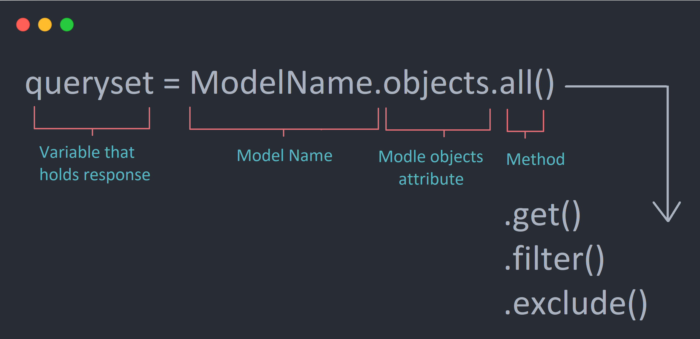

**Date:2024-09-13**

# Building a CRUD app
We are going to learn Django by buid an app. This app will perform some crud operations. Here CRUD stands for:
1. Create:
2. Read:
3. Update:
4. Delete

### Getting started with Django
Django is  python framework for building web-based ups using python and other tools. We will learn how to start building django apps.

To create a django project, it is advisable to first create a virtual environment to install all the dependencies locally that the project require. This is to ensure that the required dependencies do not interfere with global installations. One way to create a virtual environment is to use the following command in the terminal:
> ``` python -m venv venv-name ```

After this command, activate the virtual environment and install django in it using the **pip** command:
> ``` source venv-path/bin/activate ```

>``` pip3 install django ```

#### Creatimg a django project
Now, we can  create a django project using the following command:
> django-admin startproject **proj-name**.

Change directoy into **proj-name** and run ```python manage.py runserver ``` to make sure django is properly installed.

#### Creating a django app in the django project crm
We can create as many apps as we want. The first app we will create is the **webapp**. This is created using the command
> django-admin startapp **webapp**

Next, register the app in the --settings.py-- file as shown below:
```python
    INSTALLED_APPS = [
    'django.contrib.admin',
    'django.contrib.auth',
    'django.contrib.contenttypes',
    'django.contrib.sessions',
    'django.contrib.messages',
    'django.contrib.staticfiles',
    
    #custom apps
    'appname.apps.AppnameConfig',
    ]
```

Repeat this process for every app created.


#### Migration
Run migrations to migrate all django default apps:
> python3 manage.py migrate

#### Create superuser
> python3 manage.py createsuperuser

#### Using urls:
Adding urls: It is advisable not to use the urls.py files in the project folder. Instead, create a separate urls.py for each app and make it known to django in the main urls.py file: In the project's "urls.py" file, import the include module: 
 ```python
  from django.urls import path, include
  ```
  and then include the app_name's urls.py as follows

```python
    urlpatterns = [
        path('admin/', admin.site.urls),
        path('', include('app_name.urls')),
    ]
```

Next, in the app "urls.py" file

```python
    from django.urls import path
    from . import views

    urlpatterns = [
        path('', views.index, name='index'),
        path('about/', views.about, name='about'),
        path('contact/', views.contact, name='contact'),
        path('route_name', views.route_name, name='route_name'),
    ]
```

#### Static files
Create a folder called static in the project folder. In it create folders for javascript files, css files. 

Next, configure it in the settings.py files
> STATICFILES_DIRS = [BASE_DIR/ 'static']


*In production, there other way to do it* We will come back to this. 

#### Templates

There are two way to set this up:
1. Project (root) level templates
2. App level temlates 

To create pages, use template: Create a 'templates' folder in the project folder. Next let django know about it in the settings.py file:
            
```python
    TEMPLATES = [
        {
        'BACKEND': 'django.template.backends.django.DjangoTemplates',
        'DIRS': [
                #Letting django know about templates folder
                BASE_DIR/'templates'
                
                ],
        'APP_DIRS': True,
        'OPTIONS': {
            'context_processors': [
            'django.template.context_processors.debug',
            'django.template.context_processors.request',
            'django.contrib.auth.context_processors.auth',
            'django.contrib.messages.context_processors.messages',
            ],
        },
        },
    ]
```
We can separate templates into root templates and app templates. This way each app will contain its template. We can then extend the root template. Create a templates folder 'templates' in the each app folder and in it create another folder, 'templates/app_name', to contain pages associates to that app.


### Creating forms in a django applications
##### Functionalities needed to set up login and register forms.
In the **webapp** create a **forms.py** file. This will contain the functionalies for setting up the login and register forms.


To create a form for registration(create user form) and login forms for a user, we need the following imports:

```python

# For creating a user
from django.contrib.auth.forms import UserCreationForm
from django.contrib.auth.models import User

from django.forms import widgets

#for login forms
from django.contrib.auth.forms import AuthenticationForm
from django import forms
```

To create a *sign up* or *create a user* form, we can use the following code:

```python
# This class is for creating a sign up form to register/create a user.
class CustomUserCreationForm(UserCreationForm):
    class Meta:
        model = User
        fields = ['username', 'password1', 'password2'] #More fields can be added.

    #Optional: This can be done in html. Use this function to add attributes to html widgets.
    def __init__(self, *args, **kwargs):
        super(CustomUserCreationForm, self).__init__(*args, **kwargs)
        
        #Adding attribute to form fields
        # A hack
        for name, field in self.fields.items():
            field.widget.attrs.update({'class':'input'})

```

To create a login in form use the following. This can be done with html also. 
```python

#Login a user
class LoginForm(AuthenticationForm):
    username = forms.CharField(widget=TextInput())
    password = forms.CharField(widget=PasswordInput())
```


#### Authentication
To authenticate a form, we need the following imports.
```python
from django.contrib.auth import login, authenticate, logout
from django.contrib.auth.models import auth
```

### Models
Django allows us to work with data, without having to change or upload files in the process. In Django, data is created in objects, called *Models*. These Models are actually tables in a database.

All Models are described in a file called models.py in the *app* folder

When a Model is describd in the models.py file, we must run the following commands to create the table in the database and migrate all to our django project:
> python3 manage.py makemigrations Model_name

> python3 manage.py migrate 

We can view the sql commands using the following command:
> py manage.py sqlmigrate members 0001

##### Model registration
After creating and migrating the model, we need to register it in admin.py in the correponding app:
```python
from .models import Record
admin.site.register(Record)
```

  
### How to query database:
#### Query Set syntax


#### Query Set List


### Dynamic content using Django tags -- Jinja: 

There are a few kinds of delimiters. The default Jinja delimiters are configured as follows:
-  for  Statements
- {{ ... }} for Expressions to print to the template output
- {# ... #} for Comments not included in the template output


See Django template documantation [https://docs.djangoproject.com/en/4.1/topics/templates/](https://docs.djangoproject.com/en/4.1/topics/templates/) or Use this resources [https://jinja.palletsprojects.com/en/3.1.x/templates/](https://jinja.palletsprojects.com/en/3.1.x/templates/)

### Updating
#### Dynamic url routing.
This is done by changing the urls by passing dynamic values to the urls. Post fix the ***route_name/*** with "\<str:pk\>" as shown below:

```python
#passing dynamic data
#pk below is the dynamic data to be passed
path('route_name/<str:pk>', views.route_name, name='route_name'),
